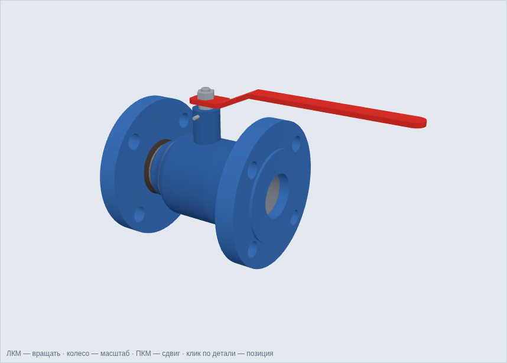
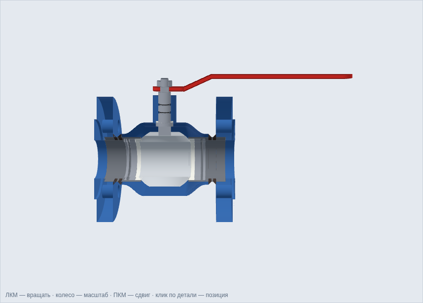

# Кран шаровой DN 50 PN 40: 3D-модель по рисунку 1.1

Твердотельная параметрическая модель шарового крана из ВКР «Технология изготовления
сварного корпуса шарового крана» (рисунок 1.1, 14 позиций). Модель построена в
CadQuery (ядро OpenCASCADE) и выгружена в нейтральные форматы, которые открываются в
КОМПАС-3D, SolidWorks, Inventor, NX и FreeCAD.

| Изометрия | Разрез по оси (как рис. 1.1) |
|---|---|
|  |  |

## Файлы

| Путь | Что это |
|---|---|
| `out/kran_DN50_PN40_sborka.step` | сборка (STEP AP214, детали с именами и цветами) |
| `out/kran_DN50_PN40_sborka.glb` | сборка для просмотра (glTF) |
| `out/parts_step/*.step` | каждая деталь отдельно |
| `out/parts_stl/*.stl` | каждая деталь для 3D-печати или визуализации |
| `viewer/index.html` | интерактивный просмотр: разрез, разнесённый вид, «открыт/закрыт», спецификация |
| `build_model.py` | параметрический исходник: все размеры — константы в начале файла |

Пересборка: `pip install cadquery && python build_model.py`. Скрипт также проверяет
габариты и взаимные пересечения деталей.

Система координат: X — ось прохода, Z — ось штока, начало — центр шаровой пробки, мм.

## Спецификация

| Поз. | Наименование | Кол. | Материал / стандарт | Основные размеры в модели |
|---|---|---|---|---|
| 1 | Пробка шаровая | 1 | 20Х13 ГОСТ 5632-2014 | сфера Ø80, проход Ø45, лыски ±35, паз 6,4 под шток |
| 2 | Шток | 1 | 20Х13 ГОСТ 5632-2014 | Ø16, бурт Ø22 (защита от выдавливания), поводок 16×6, квадрат 11, резьба M10 |
| 3 | Корпус (с горловиной) | 1 | сталь 20 ГОСТ 1050-2013 | стенка s = 4, наружный Ø94, горловина Ø30 |
| 4 | Патрубок | 2 | труба 57×4 ГОСТ 8732-78, сталь 20 | Ø57×4, расточка Ø53 под пакет седла |
| 5 | Кольцо уплотнительное шара (седло) | 2 | фторопласт-4 ГОСТ 10007-80 | Ø53/Ø45, сферическая поверхность R40 |
| 6 | Втулка крепёжная | 2 | сталь 20 | Ø53/Ø45×8 |
| 7 | Пружина тарельчатая | 2 | 60С2А ГОСТ 14959-2016 | Ø53/Ø45, s = 1,2, высота 3 |
| 8 | Шайба упорная | 2 | сталь 20 | Ø53/Ø45×3 |
| 9 | Прокладка штока | 1 | фторопласт-4 ГОСТ 10007-80 | Ø22/Ø16×2 |
| 10 | Кольцо 013-016-19 | 2 | ГОСТ 9833-73 | канавка Ø13×2,6 на штоке, отверстие Ø16,2 |
| 11 | Штифт 4×12 | 1 | ГОСТ 3128-70 | упор ограничения поворота рукоятки |
| 12 | Фланец 01-50-40-B | 2 | Ст3сп ГОСТ 380-2005; ГОСТ 33259-2015 | см. ниже |
| 13 | Рукоятка | 1 | Ст3, полоса 20×5 | вылет 330 от уплотнительной поверхности, верх на 109 от оси |
| 14 | Гайка M10 | 1 | ГОСТ 5915-70 | S = 17, m = 8 |
| — | Шов №1 (патрубок — фланец) | 2 | ГОСТ 14771-76, способ ИП | угловой, K = 4 (разд. 2.4 ВКР) |
| — | Шов №2 (корпус — патрубок) | 2 | ГОСТ 14771-76, способ ИП | K = 4 |

## Соответствие стандартам

| Требование | Источник | В модели |
|---|---|---|
| Строительная длина L = 180 | рис. 1.1 | 180,0 (от уплотнительной поверхности до уплотнительной поверхности) |
| Присоединительные размеры фланца DN 50 PN 40 | ГОСТ 33259-2015 (ряд 2) = ГОСТ 12815-80 | D = 160, D1 = 125, 4 отв. Ø18 под M16 |
| Уплотнительная поверхность | ГОСТ 33259-2015 исп. B = ГОСТ 12815-80 исп. 1 | выступ d2 = 102, f = 3 |
| Толщина фланца | ГОСТ 33259-2015, PN 40 DN 50 | b = 21 |
| Отверстия фланца вне вертикальной оси | общепринятая практика для арматуры | повёрнуты на 45° |
| Патрубок | ГОСТ 8732-78, расчёт разд. 2.4 ВКР | труба 57×4 |
| Посадка патрубка во фланец | рис. 2.6 ВКР | гнездо Ø57,5 глубиной 12 |
| Высота 109 и вылет рукоятки 330 | рис. 1.1 | 109,0 и 330,0 |
| Уплотнение штока | ГОСТ 9833-73 | кольца 013-016-19 с расчётным натягом |
| Гайка, штифт | ГОСТ 5915-70, ГОСТ 3128-70 | M10 S17 m8; Ø4×12 |

## Допущения

- Рисунок 1.1 — схема без полной простановки размеров. Размеры внутренних деталей
  (шар, седла, шток, корпус) сняты с рисунка по масштабу, известному из размеров
  180 / 190 / 109 / 330, и согласованы между собой так, чтобы детали не пересекались.
- Высота «190» получается 189 мм: верх рукоятки 109 плюс радиус фланца 80
  (D = 160 по ГОСТ 12815). По ряду 1 ГОСТ 33259 (D = 165) было бы 191,5.
- Резьба M10 и отверстия под шпильки показаны упрощённо, без витков — так принято
  для 3D-моделей по ГОСТ 2.052-2015.
- Сварные швы выделены отдельными телами, чтобы было видно их расположение и катет.
- Проход шара Ø45 уже внутреннего диаметра патрубка Ø49: на этом диаметре
  размещается седло шириной 4 мм. Если нужен полнопроходной кран, измените
  `BALL_BORE`, `SEAT_ID`, `SEAT_OD` и `BALL_D` в `build_model.py` и пересоберите.
